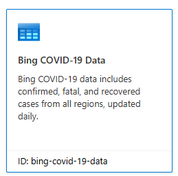
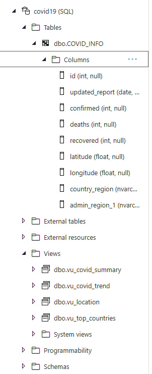

# Azure Synpase and Power BI
Azure Synpase for covid 19 data and get Data Insights and Visualization Data in Power BI.

## About of Project 
the Data has all cases records such as confirmed, deathes, recoverd and country_region and other columns.
The ETL process was designed to get Data Insights to Make Visualization easier.
Visualization Data performed by Power BI.

The required processing exceeds this previous data to store it in the database and Covid Info will be stored in a separate table:

## Views Rules

- `vu_covid_summary`: holds the sum of confirmed, deathes, recovered and total active numbers.
- `vu_covid_trend`: holds the total confirmed, total deaths and total recovered.
- `vu_location holds`: top 10 countries with most total confirmed.
- `vu_top_contries`: holds top 10 countries with most total confirmed and total deaths.

## Tools i used 
- Microsoft Azure
- Microsoft Power BI.
- SQL

## Data Visualization Image

## Conclusion
This project shows how to manpulate data with Microsoft Azure for Covid 19 Records and applying business rules using Power BI
